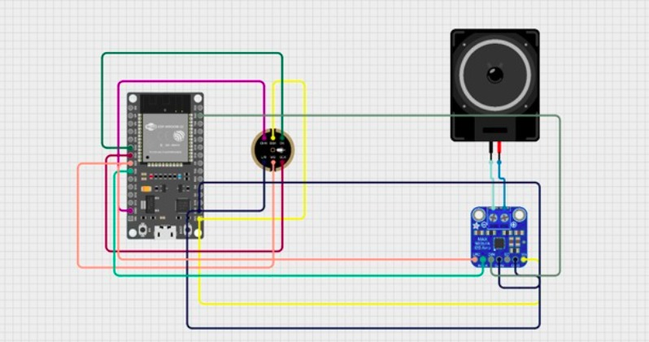
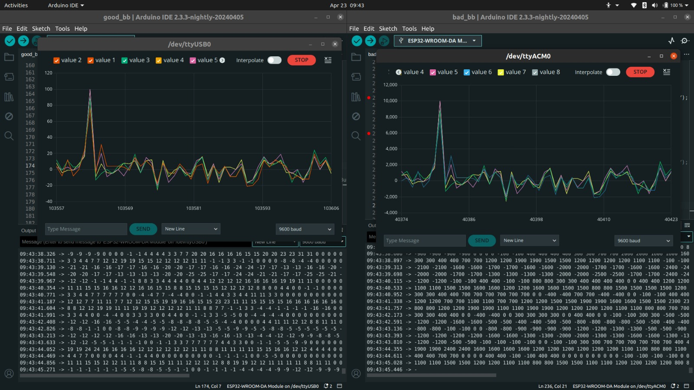

## Description 
Implementation of voip using esp32 and i2s protocol as part of MPCA course project

## Parts
- inmp441 microphone
- max98357a i2s amplifier
- speaker
- esp32

## Circuit diagram

## Results

